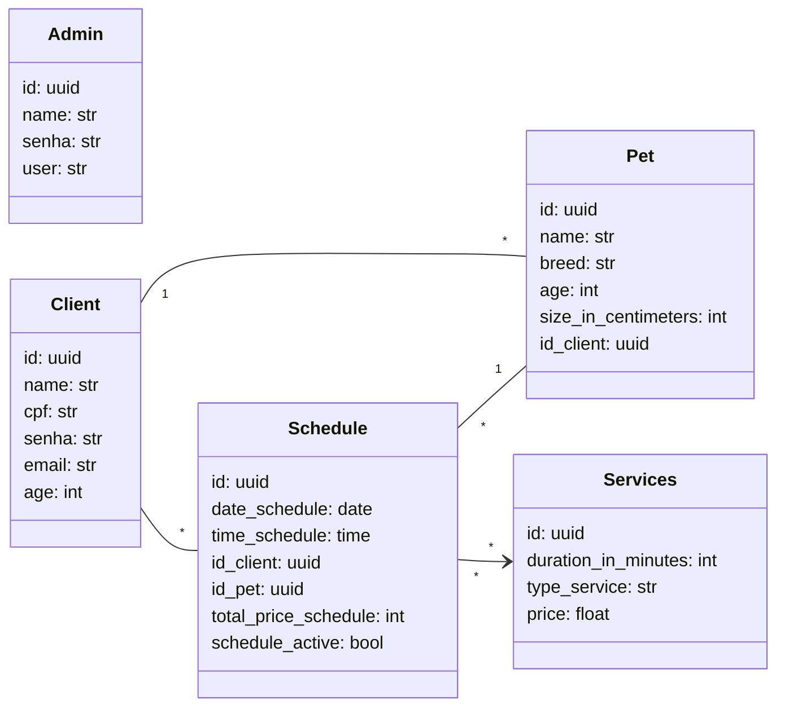

# 🐾 PetShop Management API

Uma API REST robusta para gerenciamento completo de PetShop, desenvolvida com FastAPI e seguindo princípios de Clean Architecture. O sistema oferece controle total de clientes, pets, agendamentos e serviços veterinários.

## 📋 Índice

- [Sobre o Projeto](#sobre-o-projeto)
- [Funcionalidades](#funcionalidades)
- [Tecnologias](#tecnologias)
- [Arquitetura](#arquitetura)
- [Pré-requisitos](#pré-requisitos)
- [Instalação](#instalação)
- [API Endpoints](#api-endpoints)
- [Configuração](#configuração)

## 🎯 Sobre o Projeto

Este projeto foi desenvolvido para modernizar e digitalizar o gerenciamento de petshops, oferecendo uma solução completa para:

- **Gestão de Clientes**: Cadastro, atualização e controle de dados dos proprietários de pets
- **Gerenciamento de Pets**: Registro detalhado dos animais com informações sobre raça, idade e características
- **Sistema de Agendamentos**: Controle de consultas e serviços com data e horário
- **Catálogo de Serviços**: Gestão de tipos de serviços oferecidos com preços e duração
- **Autenticação Segura**: Sistema de login diferenciado para administradores e clientes
- **Controle de Acesso**: Middleware de autenticação com JWT tokens

## ✨ Funcionalidades

### 👥 Gestão de Clientes
- ✅ Cadastro de novos clientes
- ✅ Autenticação com email e senha
- ✅ Busca de clientes (apenas administradores)
- ✅ Atualização de dados (apenas administradores)
- ✅ Exclusão de contas (apenas administradores)

### 🐕 Gestão de Pets
- ✅ Cadastro de pets vinculados aos clientes
- ✅ Listagem de todos os pets do cliente
- ✅ Busca específica de pets
- ✅ Atualização de informações dos pets
- ✅ Exclusão de registros de pets

### 🗓️ Sistema de Agendamentos
- ✅ Criação de agendamentos com múltiplos serviços
- ✅ Validação de conflitos de horário
- ✅ Limitação de até 3 serviços por agendamento
- ✅ Controle de duração máxima (120 minutos)
- ✅ Validação de dias úteis (não funciona aos domingos)
- ✅ Listagem de agendamentos (admins)
- ✅ Visualização de agendamentos ativos
- ✅ Cancelamento de agendamentos com notificação por email
- ✅ Solicitação de cancelamento com token JWT
- ✅ Exclusão de agendamentos (com validação de data)

### 🛠️ Gestão de Serviços
- ✅ Cadastro de novos tipos de serviços
- ✅ Definição de duração e preços dos serviços
- ✅ Listagem de todos os serviços disponíveis
- ✅ Atualização de serviços (com validação de agendamentos)
- ✅ Exclusão de serviços (com proteção contra agendamentos ativos)
- ✅ Relacionamento muitos-para-muitos com agendamentos

### 📧 Sistema de Notificações
- ✅ Envio de emails automáticos para cancelamento
- ✅ Configuração SMTP para envio de emails
- ✅ Templates personalizados para notificações
- ✅ Notificação apenas para o cliente proprietário

### 🔐 Segurança
- ✅ Autenticação JWT diferenciada (Admin/Cliente)
- ✅ Hash de senhas com bcrypt
- ✅ Middleware de autorização por perfil
- ✅ Tokens específicos para cancelamento
- ✅ Validação de permissões por endpoint
- ✅ Proteção de rotas sensíveis

## 🛠️ Tecnologias

### Backend
- **[Python 3.12+](https://python.org/)** - Linguagem de programação
- **[FastAPI](https://fastapi.tiangolo.com/)** - Framework web moderno e rápido
- **[SQLModel](https://sqlmodel.tiangolo.com/)** - ORM moderno baseado no SQLAlchemy
- **[PostgreSQL](https://postgresql.org/)** - Banco de dados relacional
- **[Alembic](https://alembic.sqlalchemy.org/)** - Migrations do banco de dados

### Segurança & Autenticação
- **[PyJWT](https://pyjwt.readthedocs.io/)** - Geração e validação de tokens JWT
- **[Passlib](https://passlib.readthedocs.io/)** - Hash de senhas
- **[python-decouple](https://github.com/henriquebastos/python-decouple)** - Gerenciamento de variáveis de ambiente

### Comunicação
- **[SMTP](https://docs.python.org/3/library/smtplib.html)** - Envio de emails para notificações
- **[SSL](https://docs.python.org/3/library/ssl.html)** - Conexões seguras para email

### Desenvolvimento & Testes
- **[Pytest](https://pytest.org/)** - Framework de testes
- **[Pytest-asyncio](https://pytest-asyncio.readthedocs.io/)** - Suporte a testes assíncronos
- **[Pytest-mock](https://pytest-mock.readthedocs.io/)** - Mocking para testes
- **[Ruff](https://github.com/astral-sh/ruff)** - Linter e formatter
- **[Pylint](https://pylint.pycqa.org/)** - Análise estática de código

### DevOps
- **[Docker](https://docker.com/)** - Containerização
- **[Docker Compose](https://docs.docker.com/compose/)** - Orquestração de containers

## 🏗️ Arquitetura

O projeto segue os princípios da **Clean Architecture**, garantindo:

- **Separação de responsabilidades**
- **Baixo acoplamento**
- **Alta coesão**
- **Testabilidade**
- **Manutenibilidade**

### Estrutura de Pastas

```
src/
├── main/                    # Camada de apresentação
│   ├── routes/             # Definição das rotas da API
│   ├── adapters/           # Adaptadores de requisição
│   ├── composers/          # Injeção de dependências
│   └── server/            # Configuração do servidor
├── modules/               # Módulos de negócio
│   ├── authenticate_admin/ # Autenticação de administradores
│   ├── authenticate_user/  # Autenticação de usuários
│   ├── pet/               # Domínio de pets
│   ├── schedule/          # Domínio de agendamentos
│   └── user/              # Domínio de usuários
├── infra/                 # Camada de infraestrutura
│   └── db/               # Configurações do banco
│       ├── entities/     # Entidades do banco
│       └── repositories/ # Repositórios
├── drivers/              # Drivers externos
│   ├── jwt/             # Serviços JWT
│   └── password_hasher/ # Hash de senhas
├── middlewares/          # Middlewares de autenticação
├── errors/              # Tratamento de erros
└── tests/               # Testes automatizados
```

## 📋 Pré-requisitos

- **Python 3.12+**
- **Docker** e **Docker Compose**
- **Git**

> **⚠️ Importante**: Certifique-se de criar o arquivo `.env` com as configurações corretas antes de executar a aplicação. Veja a seção [Configuração](#%EF%B8%8F-configuração) para mais detalhes.

## 🚀 Instalação

### 🐳 Opção 1: Instalação com Docker (Recomendada)

#### 1. Clone o repositório
```bash
git clone https://github.com/Andremelo001/schedule-pet-shop.git
cd schedule-pet-shop
```

#### 2. Configure as variáveis de ambiente
```bash
# Crie o arquivo .env baseado no exemplo
cp .env.example .env
# Edite o arquivo .env com suas configurações
```

#### 3. Inicie toda a aplicação com Docker
```bash
# Inicia o banco de dados e a aplicação
docker-compose up -d --build
```

#### 4. Execute as migrations (primeira vez)
```bash
# Execute as migrations para criar as tabelas
docker-compose exec app alembic upgrade head
```

A API estará disponível em: `http://localhost:8000`
A documentação da API estará em: `http://localhost:8000/docs`

---

### 💻 Opção 2: Instalação Local (Desenvolvimento)

#### 1. Clone o repositório
```bash
git clone https://github.com/Andremelo001/schedule-pet-shop.git
cd schedule-pet-shop
```

#### 2. Configure o ambiente virtual
```bash
# Instale o UV (se ainda não tiver)
pip install uv

# Crie e ative o ambiente virtual
uv venv
# No Windows
.venv\Scripts\activate
# No Linux/Mac
source .venv/bin/activate

# Instale as dependências
uv pip sync pyproject.toml
```

#### 3. Configure as variáveis de ambiente
```bash
# Crie o arquivo .env baseado no exemplo
cp .env.example .env
# Edite o arquivo .env com suas configurações
```

#### 4. Inicie apenas o banco de dados
```bash
# Inicia apenas o PostgreSQL
docker-compose up db -d
```

#### 5. Execute as migrations
```bash
# Execute as migrations para criar as tabelas
alembic upgrade head
```

#### 6. Inicie a aplicação localmente
```bash
fastapi dev src/main/server/server.py
```

A API estará disponível em: `http://localhost:8000`  
A documentação da API estará em: `http://localhost:8000/docs`

## 📋 API Endpoints

### 👥 Clientes (`/clients`)
- `POST /create` - Cadastrar novo cliente
- `GET /find` - Buscar cliente por CPF (Admin)
- `PUT /update` - Atualizar dados do cliente (Admin)
- `DELETE /delete` - Excluir cliente (Admin)
- `POST /login` - Login de cliente
- `GET /get_client_with_pets_and_schedules` - Relatório completo (Admin)

### 🐕 Pets (`/pets`)
- `POST /create` - Cadastrar novo pet (Cliente)
- `GET /get_all_pets` - Listar pets do cliente (Cliente)
- `GET /finder` - Buscar pet específico (Cliente)
- `PUT /update` - Atualizar dados do pet (Cliente)
- `DELETE /delete` - Excluir pet (Cliente)

### 📅 Agendamentos (`/schedules`)
- `POST /create` - Criar agendamento (Cliente)
- `POST /request_cancel_schedule` - Solicitar cancelamento (Cliente)
- `POST /cancel_schedule` - Cancelar agendamento (Token JWT)
- `DELETE /delete` - Excluir agendamento (Admin)
- `GET /list` - Listar todos agendamentos (Admin)
- `GET /list_schedules_actives` - Listar agendamentos ativos (Admin)

### 🛠️ Serviços (`/services`)
- `POST /create` - Cadastrar serviço (Admin)
- `GET /list` - Listar todos serviços (Admin)
- `PUT /update` - Atualizar serviço (Admin)
- `DELETE /delete` - Excluir serviço (Admin)

### 👨‍💼 Admin (`/admin`)
- `POST /login` - Login de administrador

## ⚙️ Configuração

### Variáveis de Ambiente

Crie um arquivo `.env` na raiz do projeto:

```env
# Banco de Dados PostgreSQL (usado pelo Docker)
POSTGRES_DB=db_petshop
POSTGRES_USER=petshop
POSTGRES_PASSWORD=sua_senha_segura
POSTGRES_PORT=5432

# URL de Conexão (usada pela aplicação)
DATABASE_URL="postgresql+asyncpg://petshop:sua_senha_segura@db:5432/db_petshop"

# JWT
JWT_SECRET=your-super-secret-jwt-key-muito-segura
JWT_ALGORITHM=HS256
JWT_EXPIRATION_TIME=3600

# Admin
SENHA_ADMIN="sua_senha_admin_segura"

# Email (SMTP) - Configuração opcional
EMAIL_HOST="smtp.ethereal.email"
EMAIL_PORT="587"
EMAIL_USERNAME="seu_email"
EMAIL_PASSWORD="senha_email"
```
> **🔒 Segurança**: 
> - Nunca commite o arquivo `.env` no repositório
> - Use senhas fortes e únicas
> - Em produção, use variáveis de ambiente do sistema

## 🏛️ Modelo de Dados



## 👨‍💻 Autor

**André Melo**
- GitHub: [@Andremelo001](https://github.com/Andremelo001)
- LinkedIn: [André Melo](www.linkedin.com/in/melooandree)

---

⭐ Se este projeto foi útil para você, considere dar uma estrela no repositório! 
