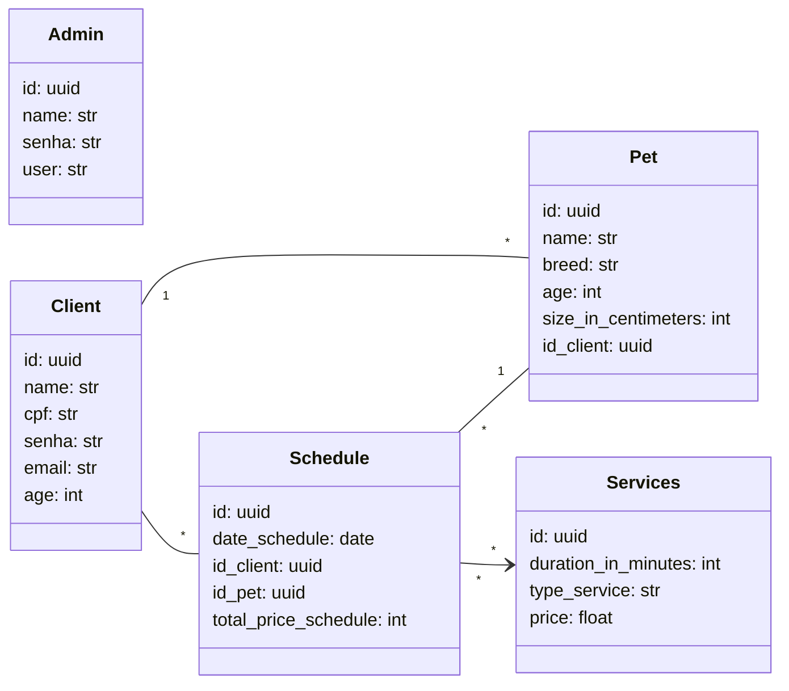

# API para gerenciamento de PetShop
API para gerenciamento de PetShop - Controle de clientes, pets, agendamentos e serviços veterinários.

# Tecnologias Utilizadas
    - Python
    - FastApi
    - PostgreSQL
    - SQLModel
    - Docker
    - Pytest

# Diagrama da Aplicação

